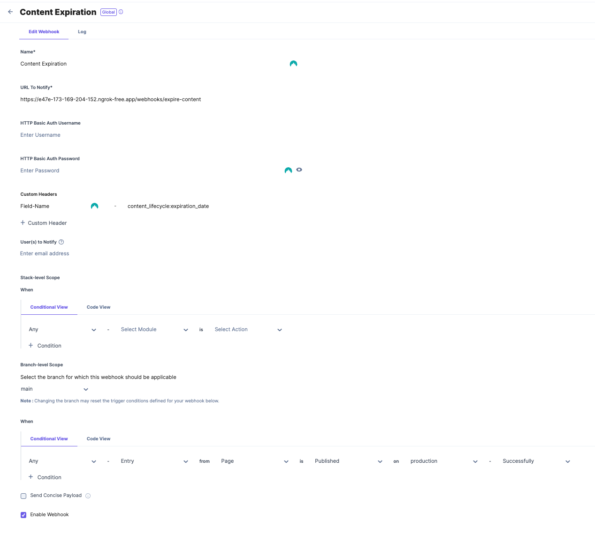

# Expire Content Webhook Documentation

## How to invoke it

`<your-host>/webhooks/expire-content`

**Note:** make sure you add the `Field-Name` header in the webhook configuration in Contentstack. Do not use **_concise_** payload.

## What does it do?

Schedules an unpublish action for the entry at a specific date, provided in a field.

## How does it do it?

1. Using the webhook payload. It gets the entry fields.
1. Looks in the received headers for a `Field-Name` header.
1. Uses the header value to retrieve the desired unpublish date. e.g. for a `Field-Name` header with value `content_lifecycle:expiration_date`, it will navigate through the following payload:

   Path to expiration date: `#root > content_lifecycle > expiration_date`

   ```javascript
   {
    _version: 79,
    locale: 'en-us',
    uid: 'blt30cd8451fbc22387',
    ACL: {},
    _in_progress: false,
    content_lifecycle: { expiration_date: '2023-04-20T20:15:00.000Z' },
    created_at: '2022-12-14T19:04:08.798Z',
    created_by: '<user-uid>',
    page_components: [
        { hero_banner: [Object] },
        { section: [Object] },
        { section_with_buckets: [Object] },
        { from_blog: [Object] },
        { section_with_cards: [Object] },
        { section_json_rte: [Object] }
    ],
    seo: {
        meta_title: 'Tekt',
        meta_description: 'Welcome to Tekt',
        keywords: 'architecture design tekt',
        enable_search_indexing: true
    },
    tags: [],
    title: 'Home',
    updated_at: '2023-04-13T12:59:41.279Z',
    updated_by: '<user-uid>',
    url: '/',
    publish_details: {
        environment: 'blt9c6eb497f0b65da9',
        locale: 'en-us',
        time: '2023-04-13T13:43:56.424Z',
        user: '<user-uid>'
    }
   }
   ```

   1. Once the expiration date is retrieved, it checks in the publishing queue for potential existing unpublish actions scheduled for this entry. This webhook removes **ALL** unpublish actions. Your use case might differ, for example, you might just wanna delete any unpublish action that is "older" than the current expiration date.
   1. Once all scheduled unpublish actions are deleted. It schedules a new unpublish action on the expiration date retrieved from the entry field.

### Sample webhook config


